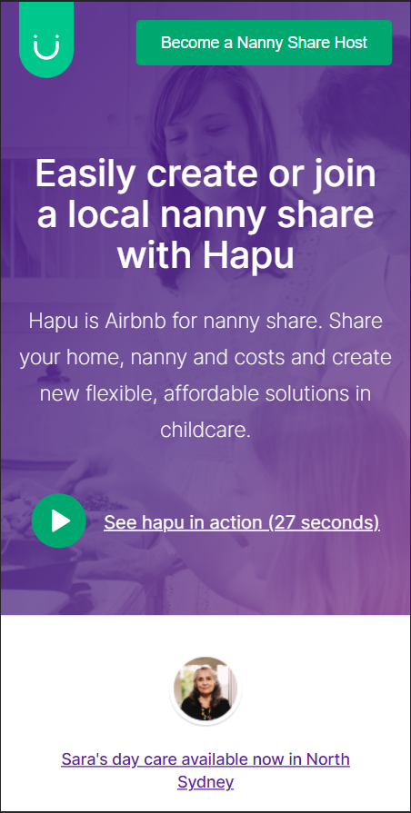

# Jungle Devs - React Challenge #001

## Result

#### Web App


#### Mobile


## Instructions
I'm experiencing Vite lately, and I thought it was a good choice to use in this code challenge. Vite has a faster development environment compared to Webpack and Parcel, and it's a lot lighter as well.

In order to open development environment, run:
```
  yarn dev
```

Vite has it's own serve script. So, to build the application and serve static files, run:
```
  yarn build
  yarn serve
```


## Description

**Challenge goal**: The purpose of this challenge is to give a general idea of how React works and how you can use it to create simple reactive applications. You’ll be implementing a simplified version of Hapu’s ‘Become a Nanny Share Host’ view. The concepts that you’re gonna apply are:

- JSX;
- Components, props and state;
- Lifecycle Methods;
- Responsive design with CSS media-queries;
- API calls;
- Error handling;
- Loading states;
- SEO & accessibility;
- A/B tests;
- Production builds.

**Target level**: This is an all around challenge that cover both juniors and experience devs based on the depth of how the concepts were applied.

**Final accomplishment**: By the end of this challenge you'll have a production ready build.

## Resources

**Design**: [Figma](https://www.figma.com/file/iBxoiuoSXy3SiOAnwXo2Np/Frontend-%E2%80%93-Challenge-1)

## Acceptance criteria

- Clear instructions on how to run the application in development mode
- Clear instructions on how to create production builds
- Logos should be exported in SVG
- Implement the mobile version using CSS Media Queries
- Hero section should have an A/B test, persistent for the user, that will either display the design version or:
  - Title: Create the childcare you need at a price you can afford
  - Description: Connect with other local families to share a nanny from as low as $10.00/hr each. Create your family profile today to get started.
- Newsletter integration to be done using the following endpoint:
  - POST https://api.jungledevs.com/api/v1/challenge-newsletter/ with body:
  ```json
  {
    "name": "NAME",
    "email": "EMAIL"
  }
  ```
- Proper HTML structure for good SEO and accessibility
- Proper loading and error handling

